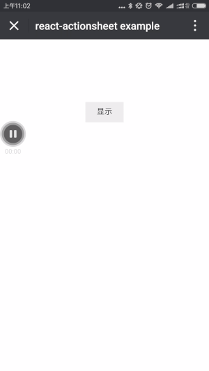

# react-actionsheet

# Installation

```
npm i react-actionsheet --save
```

# Demo



```javascript
class App extends Component {

  state = {
    show: false
  }

  onClick = () => {
    const { show } = this.state
    this.setState({show: !show})
  }

  onRequestClose = () => {
    this.onClick()
  }

  render() {
    const { show } = this.state

    const tip = show ? '隐藏' : '显示'
    const menus = [{content: '点我'}, {content: '不要点我'}]

    return (
      <div>
        <button onClick={this.onClick}>{tip}</button>

        <Actionsheet show={show} menus={menus} onRequestClose={this.onRequestClose} />
      </div>
    )
  }
}
```
